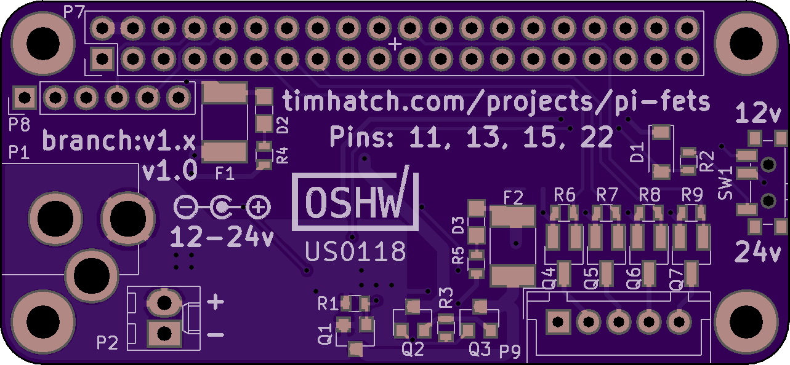

This is a small Pi hat that has simple goals:

- Power the Pi off 12 or 24V
- Control some LEDs (digital output)

Either turn channels fully on and off, or use pigpiod to emulate reasonable PWM support.

Check the branch list for other versions.
